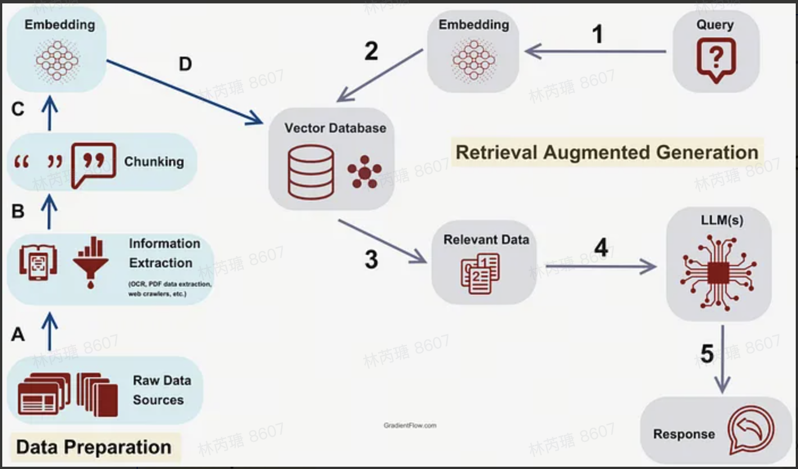
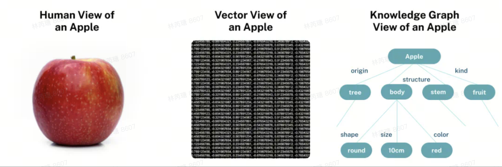
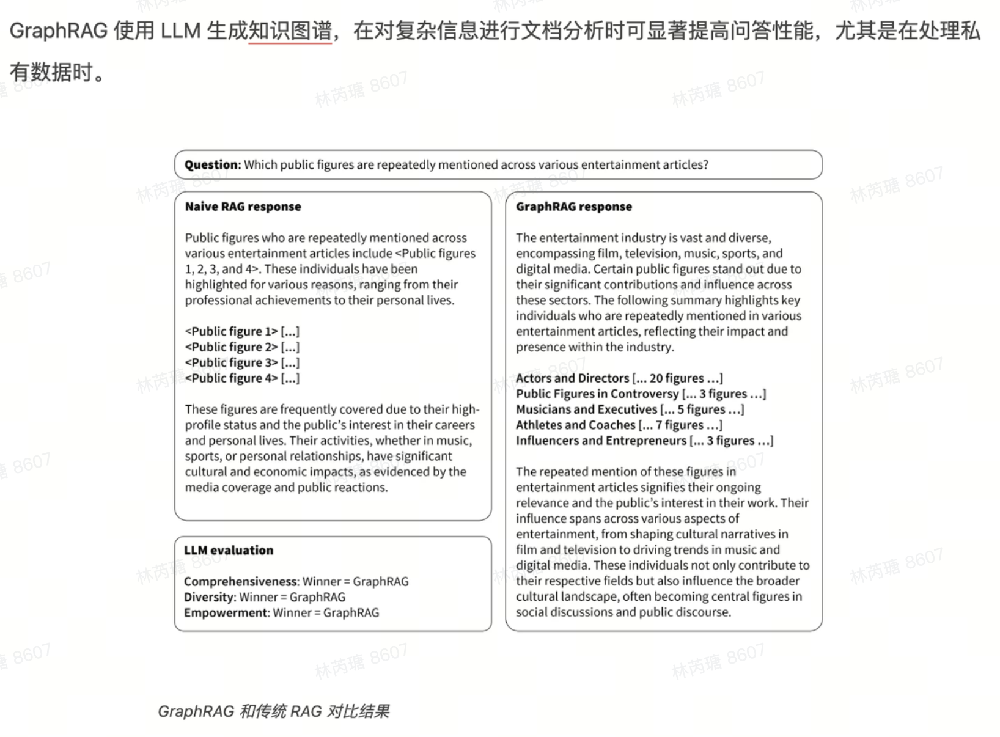
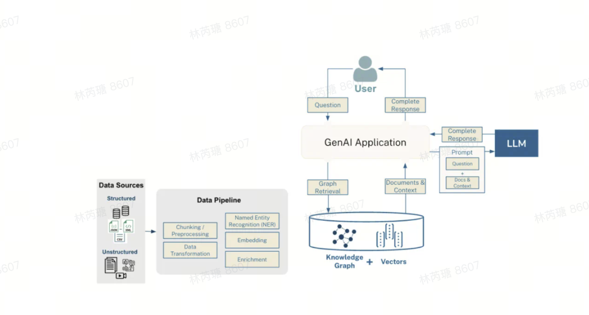
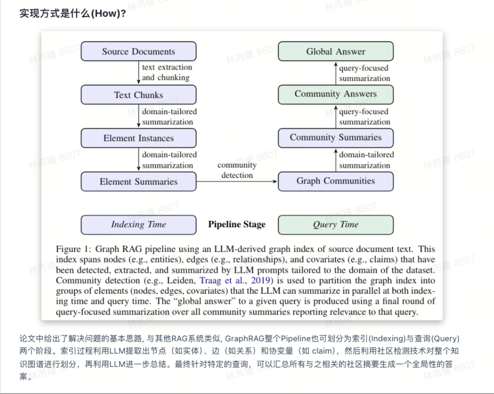

# 💡 GraphRAG解读：让LLM学会结构化思考

本篇文章只是对 GraphRAG 框架进行简单解读，标题有一点夸张。其实，RAG 加上 Graph 结构化知识图谱是否是革命性创新还有待商榷。文章中很多内容是摘抄的，原文链接在底部提供🔗。

## 什么是 GraphRAG？

GraphRAG（Graph-based Retrieval-Augmented Generation）是微软于 2024 年推出的一种新型检索增强生成框架。该框架旨在利用大型语言模型（LLMs）从**非结构化文本中提取结构化数据**，构建**具有标签的知识图谱**，以支持数据集问题生成、摘要问答等多种应用场景。

GraphRAG 的一大特色是**利用图机器学习算法**对数据集进行语义聚合和层次化分析，因此可以回答一些**相对高层级的抽象或总结性问题**，这一点恰好弥补了常规 RAG 系统的短板。

> 官网：[GraphRAG 官方页面](https://microsoft.github.io/graphrag/)  
> 论文原文：[GraphRAG: Unlocking LLM discovery on narrative private data](https://microsoft.github.io/graphrag/)

---

# RAG 与 GraphRAG

## 两种呈现知识的形式：向量和图谱

**典型 RAG 的核心是向量搜索**，即根据输入的文本块，从候选的书面材料中找到并返回概念相似的文本。这种自动化方法在基本搜索场景中非常有效。

# 💡 GraphRAG解读：让LLM学会结构化思考

本篇文章只是对 GraphRAG 框架进行简单解读，标题有一点夸张。其实，RAG 加上 Graph 结构化知识图谱是否是革命性创新还有待商榷。文章中很多内容是摘抄的，原文链接在底部提供🔗。

---

## 什么是 GraphRAG？

GraphRAG（Graph-based Retrieval-Augmented Generation）是微软于 2024 年推出的一种新型检索增强生成框架。该框架旨在利用大型语言模型（LLMs）从**非结构化文本中提取结构化数据**，构建**具有标签的知识图谱**，以支持数据集问题生成、摘要问答等多种应用场景。

GraphRAG 的一大特色是**利用图机器学习算法**对数据集进行语义聚合和层次化分析，因此可以回答一些**相对高层级的抽象或总结性问题**，这一点恰好弥补了常规 RAG 系统的短板。

> 官网：[GraphRAG 官方页面](https://microsoft.github.io/graphrag/)  
> 论文原文：[GraphRAG: Unlocking LLM discovery on narrative private data](https://microsoft.github.io/graphrag/)

---

# RAG 与 GraphRAG

## 两种呈现知识的形式：向量和图谱

### RAG 的流程

1. **文本分片与向量存储**：将文本划分成片段，并转换为向量存储到向量数据库中。这个向量表示该文本片段的语义信息。
2. **用户查询向量化**：将用户的查询转换为向量，并与数据库中的文本向量进行相似度计算，取出 Top K 个相关片段。
3. **与 LLM 交互**：将用户查询和检索出的 K 个文本片段组织成特定的 Prompt 结构，输入到 LLM 进行回答。

（计算文本的向量可以调用 API 或者使用 LlamaIndex 等库。）

### 人类视角、向量视角和图谱视角

  

- **人类视角**：苹果的表征复杂且多维，无法完全描述在纸面上。
- **向量视角**：向量表示法能捕获文本的核心信息，并用于相似度计算，但无法理解文本内部的含义。
- **图谱视角**：知识图谱是符号化（symbolic）的，能表示概念之间的关系，可被人和机器理解并用于推理。

---

## 传统 RAG 的局限性

  

传统的 RAG 依赖向量相似性搜索，将用户查询与非结构化文本片段进行匹配。然而，这种方法在以下方面存在不足：
- **难以连接信息点**：当问题需要跨多个文本片段整合信息时，传统 RAG 往往无法有效处理。
- **难以全局性总结**：在处理大型数据集或单个大型文档的总结任务时，表现较差。

因此，**Baseline RAG（基准 RAG）** 在某些情况下难以满足需求。

---

## GraphRAG 的流程

  

GraphRAG 通过**结合向量搜索与图谱查询**，提供更全面的信息检索能力：
1. **执行向量搜索或关键词搜索**，找到初始相关节点。
2. **遍历知识图谱**，带回相关节点信息。
3. **使用 PageRank 等算法对文档进行重新排名**（可选）。

不同用例可能采用不同的模式，但 GraphRAG 的核心是**利用知识图谱增强 LLM 的检索能力**。

---

## GraphRAG 的生命周期

  

使用 GraphRAG 的 LLM 应用与传统 RAG 类似，关键区别在于：
- **增加了知识图谱构建步骤**。
- **可以迭代扩展图谱**，不断优化数据质量。
- **数据网络效应**，数据越丰富，效果越好。

最终形成完整的 GraphRAG 工作流程：

  

---

## 业界观点：GraphRAG 的未来

Neo4j 公司 CTO **Philip Rathle** 在其博客文章 *《GraphRAG 宣言：将知识加入到生成式 AI 中》* 中提到：
> “你的下一个生成式 AI 应用很可能就会用上知识图谱。”

GraphRAG 相比于传统 RAG 和微调技术的主要优势包括：
- 更强的**知识整合能力**。
- 更好的**可解释性**。
- 更高效的**大规模数据推理**。

---

## 资源推荐

- **GraphRAG 框架源码**：[GitHub 地址](https://github.com/microsoft/graphrag)  
- **源码解读文章**：清晰易懂（但未涉及深层内容）。  

  
# GraphRAG 的创新之处
1. **知识图谱构建**：利用 LLM 从非结构化文本中提取实体及其关系，构建结构化的知识图谱。
2. **社区检测与层次化分析**：应用图机器学习算法（如 Louvain 或 Leiden 算法）对知识图谱进行社区检测，将密切相关的节点聚合成社区，形成层次化结构。
3. **社区摘要生成**：使用 LLM 对每个社区进行摘要，生成分层次的社区摘要，提供数据集的概览。
4. **查询处理**：当用户提出查询时，GraphRAG 检索相关的社区摘要和原始文本片段，并将这些信息与用户查询一起输入 LLM，以生成更准确和全面的回答。

---

# GraphRAG 的优势
1. **准确度更高，答案更完整**（运行时间 / 生产优势）。
2. **创建好知识图谱后，RAG 应用的构建和维护更容易**（开发时间优势）。
3. **更好的可解释性、可追溯性和访问控制**（治理优势）。
   
由于知识图谱的符号化特性，人类和机器都能很好地理解它并基于其执行推理。因此，使用 GraphRAG 构建 AI 应用不仅更简单轻松，而且能得到更优质、可审计的结果。

---

# GraphRAG 能做什么？
GraphRAG 能够：
- **连接跨多个文档的信息**，帮助回答基于关键字和向量搜索难以处理的问题。
- **支持主题性查询**，例如“这个数据集中的顶级主题是什么？”。
- **回答需要跨多个文档推理的问题**，而不仅仅是单一文档的匹配结果。

---

# GraphRAG 的预期用途
GraphRAG 适用于：
- **关键信息发现与分析**，尤其是：
  - 涉及多个文档的数据。
  - 数据质量混杂，有噪音、错误或虚假信息。
  - 需要比底层数据更抽象或主题化的推理。
- **负责任的 AI 环境**，适用于期望**批判性思维**的用户。
- **与特定领域语料库结合**，GraphRAG 本身不会收集用户数据，但用户应确保 LLM 符合数据隐私政策。

---

# GraphRAG 的评估方式
GraphRAG 主要从以下 4 个方面进行评估：
1. **数据集的准确表示**：
   - 通过手动检查。
   - 通过自动测试，与“金标准答案”对比。
2. **透明度与响应的扎实基础**：
   - 通过自动化答案覆盖度评估。
   - 通过人工检查返回的上下文。
3. **对提示和数据攻击的抗性**：
   - 采用手动和半自动技术测试用户提示注入攻击（“越狱”攻击）。
   - 测试跨提示注入攻击（“数据攻击”）。
4. **低幻觉率**：
   - 通过索赔覆盖度指标评估。
   - 手动检查答案和来源。
   - 进行对抗性攻击测试，以检验系统对恶意和异常数据的鲁棒性。

---

# GraphRAG 的局限性与应对策略
### **局限性**
1. **依赖高质量的索引**：
   - 需要良好构建的索引示例，尤其是对领域特定概念的正确识别。
   - 索引操作成本较高。

### **应对策略**
- **最佳实践**：  
  - 在目标领域创建一个**小型测试数据集**，确保索引器表现良好后，再进行大规模索引操作。

---

# GraphRAG 的运营因素与负责任使用
GraphRAG 适用于：
- 具有 **领域复杂性和经验** 的用户。
- 需要 **处理困难信息挑战** 的任务。

尽管 GraphRAG 对注入攻击和信息冲突识别较为鲁棒，但**它是为可信用户设计的**，其回答仍需要人工审核：

1. **对响应进行适当的人类分析**，以确保答案的可靠性。
2. **追踪信息来源**，确保人类理解与推理一致。

**GraphRAG 最适用于：**
- 以 **整体主题或主题为中心** 的自然语言文本数据。
- 数据内容丰富，包括 **人员、地点、事物或可唯一标识的对象**。

# GraphRAG 在业务中的应用落地

## 一. 基于 GraphRAG 的生活服务业务落地方案  

### 1. 业务场景与需求  
生活服务类平台（如外卖、家政服务、旅游服务）常见的用户需求包括：  
1. **服务推荐**：  
   - 用户寻找附近的优质服务（如家政服务、按摩、餐厅等）。  
2. **复杂问题解答**：  
   - 解答跨服务类型、跨数据源的问题（如“哪家餐厅支持家庭聚餐且提供优惠？”）。  
3. **动态信息整合**：  
   - 实时获取和整合商家营业状态、用户评价、活动优惠等。  
4. **主题性分析**：  
   - 识别平台中最受欢迎的服务类型和趋势（如“本季度热门外卖菜品”）。  

### 2. 解决方案  
通过 **GraphRAG 的检索能力和生成能力**，搭建以下功能模块：  

#### (1) 用户个性化服务推荐  
**场景**：
- 用户询问：“附近有什么评分高的按摩服务？最好有新人优惠。”  

**实现**：
1. **知识图谱构建**：  
   - **实体**：商家、用户、服务类型、优惠信息、评价。  
   - **关系**：  
     - 商家-提供->服务类型。  
     - 用户-评价->商家。  
     - 商家-参与->优惠活动。  
2. **工作流程**：  
   - **检索**：  
     - 图谱查询获取满足条件的商家列表（如评分高于4.5的按摩服务）。  
     - 向量检索从非结构化文档中提取优惠活动信息。  
   - **生成**：  
     - 使用生成式模型整合检索结果，生成个性化推荐。  
   - **输出**：  
     - “附近有 3 家评分高的按摩服务：A店（新人优惠10%）、B店（满100减20）和 C 店（免费停车）。”  

---

#### (2) 复杂问题解答  
**场景**：  
- 用户询问：“有没有适合带宠物的餐厅，且营业到晚上 10 点？”  

**实现**：
1. **知识图谱构建**：  
   - **实体**：餐厅、服务（如宠物友好）、营业时间、用户评价。  
   - **关系**：  
     - 餐厅-支持->服务。  
     - 餐厅-营业时间->时间范围。  
2. **工作流程**：  
   - **图谱查询**：  
     - 查询支持“宠物友好”服务且营业时间超过晚上 10 点的餐厅。  
   - **非结构化数据检索**：  
     - 从评价和商家描述中提取具体服务细节。  
   - **生成**：  
     - 整合检索结果生成回答。  
   - **输出**：  
     - “有 2 家餐厅适合带宠物：A 餐厅营业到 11 点，提供户外座位；B 餐厅营业到 10:30，有专属宠物区。”  

---

#### (3) 活动推荐与分析  
**场景**：  
- 用户询问：“有什么适合周末家庭出行的活动？”  

**实现**：
1. **知识图谱构建**：  
   - **实体**：活动、时间、适用人群（家庭、情侣等）、地点。  
   - **关系**：  
     - 活动-面向->人群。  
     - 活动-发生->时间、地点。  
2. **主题分析与生成**：  
   - 对平台活动数据进行主题聚类，识别“周末”“家庭出行”等关键词的高频活动。  
   - 使用生成式模型提供推荐。  
   - **输出**：  
     - “本周末适合家庭出行的活动包括：城市公园亲子嘉年华（早9点到晚5点）和科普展览（上午场10点开始，下午场2点开始）。”  

---

### 3. 技术架构  
#### (1) 系统组成  
1. **数据层**：  
   - 图数据库：Neo4j、ArangoDB。  
   - 向量数据库：Pinecone、Weaviate。  
2. **中间层**：  
   - 数据处理与分析：LangChain、Haystack。  
   - 实时数据流：Kafka。  
3. **生成层**：  
   - OpenAI GPT、Hugging Face Transformers。  
4. **前端交互**：  
   - Web（React/Vue）、App（Flutter）。  

---

## 二. GraphRAG 从企业单文档问答到批量文档问答的落地实现  

### 1. 核心目标  
1. **单文档问答**：从特定文档中快速检索目标信息并生成回答。  
   - 示例：问“企业员工手册中关于年假的规定是什么？”  
2. **批量文档问答**：整合多个文档的内容，提供跨文档的关联回答。  
   - 示例：问“去年所有部门的年假使用情况？”整合政策文件、HR 记录和年度报告。  
3. **主题性分析**：从多个文档中提取共性、总结主题，支持企业战略决策。  
   - 示例：问“近三年的项目报告中，最常见的风险点是什么？”  

---

### 2. 系统功能模块  

#### (1) 数据准备与知识图谱构建  
**实体与关系设计**  
- **实体（Nodes）**：  
  - **政策**：年假规则、福利政策、考勤规范等。  
  - **员工**：姓名、职位、部门、年假天数。  
  - **部门**：部门名称、年度报告、指标。  
  - **项目**：项目名称、负责人、风险点、收益。  
- **关系（Edges）**：  
  - 员工-属于->部门。  
  - 部门-涉及->政策。  
  - 项目-产生->风险点。  

---

### 3. 业务应用案例  

#### **案例 1：政策查询**  
**用户问题**：  
“我们员工的年假天数是多少？”  
**系统流程**：  
1. **图谱查询**“年假政策”节点，检索单文档内容。  
2. **返回明确答案**：  
   - “根据《员工手册》，年假标准为 10 天，工作满 5 年后增加 5 天。”  

#### **案例 2：跨文档信息整合**  
**用户问题**：  
“哪些部门去年未完成年假目标？”  
**系统流程**：  
1. **图谱查询**：  
   - 获取“年假政策”->“部门使用记录”关系。  
   - 提取各部门年假数据与目标对比。  
2. **向量检索**：  
   - 从年度报告中补充数据（如部门的解释）。  
3. **生成回答**：  
   - “有 3 个部门未完成年假目标：销售部（70% 使用率）、技术部（60%）、市场部（50%）。”  

---

虽然 GraphRAG 在跨文档问答、知识图谱增强检索等方面具有巨大潜力，但在实际业务应用中仍可能面临 **数据质量、语义理解不一致、跨文档关联性处理** 等挑战，需通过优化知识图谱构建和模型能力提升来持续改进。  

---

> 之前我们开源社区讨论的时候聊到怎么提高LLM的正确率，有说道采用GraphRag框架去做知识图谱然后产生的结果给客户进行一个二次确认，如果用户二次确认的回答正确，就根据这个回答来继续检索生成。如果不正确，用户就引导LLM去到正确的知识节点Node去生成正确的回答。但是这个会让用户耗费很多时间精力，但是确实会提高正确率。

### 参考文章：
- [GraphRAG: Unlocking LLM discovery on narrative private data](https://www.microsoft.com/en-us/research/blog/graphrag-unlocking-llm-discovery-on-narrative-private-data/)
- [从零实现大模型-GraphRAG，构建LLM中的关系数据库](https://mp.weixin.qq.com/s/q2BRAiivIFNXWyQIbwx18Q)
- [微软开源的GraphRAG爆火，Github Star量破万，生成式AI进入知识图谱时代？](https://www.jiqizhixin.com/articles/2024-07-15-13?utm_source=chatgpt.com)
- [微软官宣正式在GitHub开源GraphRAG](https://www.53ai.com/news/qianyanjishu/2024070310749.html?utm_source=chatgpt.com)
- [Vector | Graph：蚂蚁首个开源Graph RAG框架设计解读](https://zhuanlan.zhihu.com/p/703735293)

