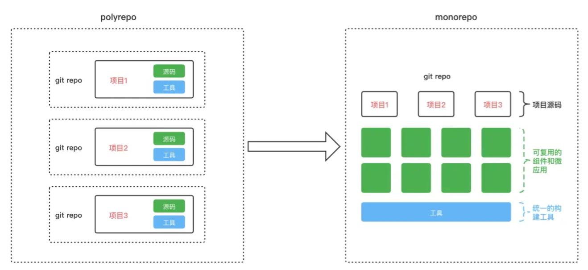
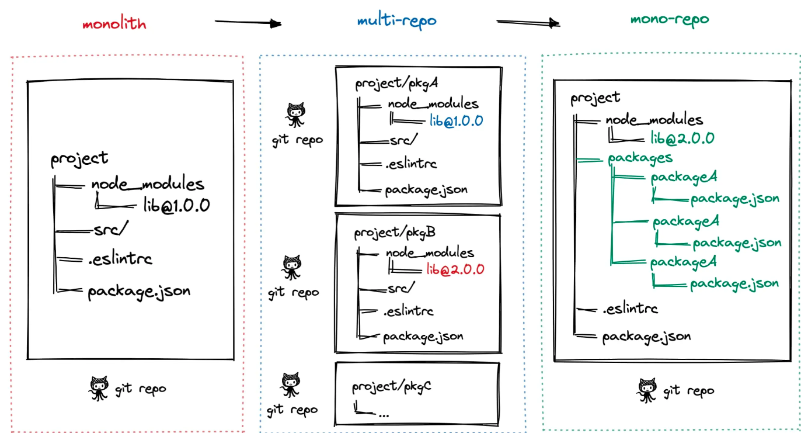

# monorepo小试牛刀

monorepo（大仓模式）是多个项目都在同一个仓库，且每个项目共享同一套构建工具

polyrepo（多仓模式）是一个项目一个仓库，且每个项目都有独立的构建工具






## 为什么需要monorepo？

使用 monorepo 方式组织代码的前提是：

> 你有多个项目，并且需要在多个项目中复用组件和逻辑。

如果每个项目都是完全独立的，没有什么共用的代码（几乎不太可能），那也许你就不需要用 monorepo 啦。

## 好处

- 便于代码复用：多个仓库都会用到的组件、工具函数、类型声明、样式等，可以放到 common 子包中，需要的仓库直接 npm install 这个子包就行，就跟 npm install 一个 npm 包一样容易。
- 独立构建和部署：每个子包都是一个独立的项目，有自己的 package.json 文件，独立安装依赖、独立端口和本地启动、独立测试、独立构建和部署，互不影响。
- 降低切换成本：由于只有单一仓库，clone 代码、切换分支、安装依赖比较方便，不用在不同文件夹之间切换。
- 节约磁盘空间：pnpm 天然具备 monorepo 能力，支持全局依赖管理，所有子包之间共享依赖，节约磁盘空间。
- 方便提交PR：由于是单仓库，增加新组件或给组件增加新特性，只需要提交一个 MR、编写一次 MR 描述、关联一次需求/缺陷单。
- 方便代码检视：一个完整的特性只需要统一在一个 MR 中检视，不用在多个仓库/多个 MR 之间切换。
- 灵活便于扩展：后续增加新的工程只需要在 packages 下增加一个子包，不需要申请新的代码仓库，也降低后续仓库维护成本，比如：配置保护分支 / GitHub Actions / 仓库标签等。

## 如果不用monorepo会怎么样？

- 方式一：把所有项目放到一个仓库里，创建很多文件夹，分别存放不同的项目，通过路由进行项目隔离。

这样做的好处是所有代码都在一起，代码复用方便，直接 ../ 就行；而且不用创建和维护仓库，不用配置一堆流水线。
坏处也显而易见，就是项目会不断膨胀，本地启动调试会越来越慢、构建打包越来越慢，包体积越来越大，项目越来越卡，最后用户受不了纷纷弃坑。

- 方式二：将项目拆分到不同的代码仓库进行维护。

好处是项目之间相互独立，不容易耦合，维护起来方便。
坏处就是增加了仓库维护成本、流水线创建成本，并且不方便项目之间复用代码。
不管是以上哪种方式，后续项目的演进都是麻烦不断，要么代码量膨胀、性能下降，要么重复劳动、一堆重复代码。

## 怎么搭建一个monorepo项目？

### 1. 选择管理工具

有很多工具可以帮助你管理 **Monorepo**，常见的工具包括：

- **Lerna**：用于管理 JavaScript 和 TypeScript 项目的 monorepo。
- **Yarn Workspaces**：Yarn 提供的功能，可以帮助你在 monorepo 中管理多个包。
- **PNPM Workspaces**：PNPM 是一个高效的包管理工具，支持 monorepo。
- **Nx**：提供许多企业级的 monorepo 功能，包括智能构建、依赖关系分析等。

以 **Yarn Workspaces** 为例进行说明。

### 2. 初始化项目

首先，初始化一个新的项目文件夹，并进入该文件夹：

```bash
mkdir my-monorepo
cd my-monorepo
```

### 3. 初始化 `package.json`

在项目根目录下运行以下命令创建一个 `package.json` 文件：

```bash
npm init -y
```

然后修改 `package.json`，添加 `workspaces` 配置：

```json
{
  "name": "my-monorepo",
  "private": true,
  "workspaces": [
    "packages/*"
  ]
}
```

- `private: true` 表示这是一个私有项目，避免发布到 npm。
- `workspaces: ["packages/*"]` 告诉 Yarn 你的所有子包都位于 `packages` 文件夹下。

### 4. 创建子包

在 `packages` 文件夹下创建多个子包（例如 `app` 和 `lib`）：

```bash
mkdir -p packages/app
mkdir -p packages/lib
```

然后分别初始化每个子包的 `package.json` 文件：

#### app/package.json
```json
{
  "name": "app",
  "version": "1.0.0",
  "main": "index.js",
  "dependencies": {
    "lib": "*"
  }
}
```

#### lib/package.json
```json
{
  "name": "lib",
  "version": "1.0.0",
  "main": "index.js"
}
```

### 5. 安装依赖

接下来，使用 Yarn 安装所有依赖：

```bash
yarn install
```

Yarn 会根据 `workspaces` 配置自动安装 `app` 和 `lib` 之间的依赖，并将它们链接起来。

### 6. 配置工作流（可选）

你可以根据需要设置脚本来简化开发工作流，比如：

#### 在根 `package.json` 中添加 `scripts`：

```json
{
  "scripts": {
    "test": "lerna run test",
    "build": "lerna run build"
  }
}
```

### 7. 使用 Lerna（可选）

如果你想进一步管理版本、发布等，可以使用 **Lerna**。Lerna 是一个帮助你管理 monorepo 的工具，它提供了跨包管理、版本控制和发布等功能。

#### 安装 Lerna：

```bash
npm install --save-dev lerna
```

#### 初始化 Lerna：

```bash
npx lerna init
```

#### 配置 Lerna：

Lerna 会创建一个 `lerna.json` 文件，修改 `lerna.json` 以启用 **固定版本模式**，并指定包路径。

```json
{
  "packages": ["packages/*"],
  "version": "independent"
}
```

在使用 Lerna 时，可以通过以下命令执行一些任务：

- `lerna bootstrap`：安装所有依赖并连接跨包依赖。
- `lerna run <script>`：在所有包中运行指定的 `script`。
- `lerna publish`：发布所有包。

### 8. 启动开发

现在，你可以开始在 monorepo 中开发了。你可以在 `app` 和 `lib` 中进行开发，修改代码并在根目录下运行相关的命令来管理和构建项目。

### 用pnpm搭建monorepo项目

首先，确保你已经安装了 `pnpm`。如果没有安装，可以使用以下命令进行安装：

```bash
npm install -g pnpm
```

可以通过运行以下命令检查 `pnpm` 是否安装成功：

```bash
pnpm --version
```

### 2. 初始化项目

在你希望创建 Monorepo 的文件夹中运行以下命令来初始化项目：

```bash
mkdir my-monorepo
cd my-monorepo
pnpm init
```

这将会生成一个基本的 `package.json` 文件。接下来，我们将设置 Monorepo 所需的结构和配置。

### 3. 配置 Monorepo 结构

在 Monorepo 中，通常会有一个根目录和多个子项目目录。让我们在 `my-monorepo` 目录下创建一个基本的结构：

```bash
my-monorepo/
  ├── packages/
  │    ├── app1/
  │    └── app2/
  ├── package.json
  └── pnpm-workspace.yaml
```

- `packages/`：存放所有子项目（包）的目录。
- `package.json`：根目录的配置文件。
- `pnpm-workspace.yaml`：用于配置工作区，定义哪些子项目是工作区的一部分。

#### 创建子项目（app1 和 app2）

在 `packages/` 文件夹下创建两个子项目：

```bash
cd packages
mkdir app1 app2
```

每个子项目都可以是一个简单的 Node.js 应用、React 应用、或其他前端、后端技术栈。你可以为每个子项目创建一个简单的 `package.json` 文件。

例如，在 `app1/package.json` 中：

```json
{
  "name": "app1",
  "version": "1.0.0",
  "dependencies": {
    "lodash": "^4.17.21"
  }
}
```

同样，在 `app2/package.json` 中：

```json
{
  "name": "app2",
  "version": "1.0.0",
  "dependencies": {
    "react": "^18.0.0"
  }
}
```

### 4. 配置 `pnpm-workspace.yaml`

在 Monorepo 的根目录下创建一个 `pnpm-workspace.yaml` 文件，该文件用于告诉 `pnpm` 哪些文件夹应该包含在 Monorepo 工作区中。

创建 `pnpm-workspace.yaml` 文件并添加以下内容：

```yaml
packages:
  - 'packages/*'
```

这意味着所有位于 `packages/` 目录下的文件夹（如 `app1` 和 `app2`）都将是工作区的一部分。

### 5. 安装依赖

现在你已经配置好了项目结构，可以开始安装依赖了。在根目录下运行以下命令：

```bash
pnpm install
```

这将会为 Monorepo 中的所有子项目安装依赖。`pnpm` 会自动识别 `pnpm-workspace.yaml` 文件中定义的工作区，安装所有的依赖，并将共享依赖的版本集中到根目录的 `node_modules` 中。

### 6. 启动和运行子项目

你可以为每个子项目添加一些脚本，像 `start` 或 `build`。例如，在 `app1/package.json` 中：

```json
{
  "name": "app1",
  "version": "1.0.0",
  "scripts": {
    "start": "node app1.js"
  }
}
```

类似地，在 `app2/package.json` 中：

```json
{
  "name": "app2",
  "version": "1.0.0",
  "scripts": {
    "start": "react-scripts start"
  }
}
```

在根目录下，你也可以定义一个可以同时启动所有子项目的脚本。编辑根目录下的 `package.json`，添加一个 `start` 脚本：

```json
{
  "name": "my-monorepo",
  "version": "1.0.0",
  "scripts": {
    "start": "pnpm --filter app1 start && pnpm --filter app2 start"
  }
}
```

这样你可以通过以下命令启动所有子项目：

```bash
pnpm start
```

### 7. 使用 `pnpm` 的工作区特性

#### 共享依赖

在 Monorepo 中，如果你有多个子项目使用相同的依赖，`pnpm` 会通过工作区机制来确保依赖只会安装一次。例如，如果 `app1` 和 `app2` 都依赖于 `lodash`，`pnpm` 会在根目录共享 `lodash`。

#### 局部依赖和版本管理

如果你需要在子项目之间共享代码，可以将公共代码放在 `packages/` 下的一个公共包中。例如，可以创建一个 `utils` 包来存放共享的工具函数：

```bash
mkdir packages/utils
```

在 `utils/package.json` 中：

```json
{
  "name": "utils",
  "version": "1.0.0"
}
```

然后，你可以在 `app1` 和 `app2` 中引用 `utils` 包：

```bash
pnpm add utils --workspace
```

这会将 `utils` 作为依赖添加到 `app1` 和 `app2` 中。

#### 使用 `filter` 命令

`pnpm` 提供了强大的过滤命令，可以针对某些包执行操作。例如，只有在 `app1` 上运行安装：

```bash
pnpm --filter app1 install
```

或者只运行 `app1` 的测试：

```bash
pnpm --filter app1 test
```

### 8. 配置 `tsconfig.json`（可选）

如果你使用 TypeScript，可以在根目录配置一个 `tsconfig.json` 来管理所有子项目的 TypeScript 配置。首先，在根目录下创建 `tsconfig.json`：

```json
{
  "compilerOptions": {
    "baseUrl": ".",
    "paths": {
      "*": ["packages/*/src"]
    }
  },
  "include": [
    "packages/**/*"
  ]
}
```

这将确保 TypeScript 能够识别所有子项目并正确编译。

### 9. 使用 CI/CD 管理 Monorepo

如果你使用持续集成/持续交付（CI/CD）工具，如 GitHub Actions、GitLab CI、Jenkins 等，可以配置 Monorepo 的构建和发布流程。例如，在 GitHub Actions 中，你可以使用 `pnpm` 来构建、测试和发布 Monorepo 项目：

```yaml
name: CI Pipeline

on: [push]

jobs:
  build:
    runs-on: ubuntu-latest

    steps:
    - name: Checkout Code
      uses: actions/checkout@v2

    - name: Set up pnpm
      uses: pnpm/action-setup@v2
      with:
        version: 8.x

    - name: Install dependencies
      run: pnpm install

    - name: Build projects
      run: pnpm run build
```

### 10. 常见问题

- **工作区依赖问题**：有时 `pnpm` 在安装时可能会因为网络问题或者权限问题导致安装失败。此时可以尝试清除缓存并重试：  
  ```bash
  pnpm store prune
  pnpm install
  ```

- **升级 pnpm 版本**：如果想要升级 `pnpm`，可以使用以下命令：
  ```bash
  pnpm add -g pnpm
  ```

> 假设你要做一个项目，项目中有多个公共模块，分别为 `common`、`commonTypes` 和 `utils`，并且这些模块将被前端和后端共享，你可以按照以下步骤来组织 Monorepo 项目。

### 1. 项目结构

假设你有以下结构：

```
my-monorepo/
│
├── pnpm-workspace.yaml      # pnpm workspace 配置
├── package.json             # 根目录的 package.json
├── apps/
│   ├── workbench/           # 前端项目
│   └── server/              # 后端项目
├── packages/                # 公共模块
│   ├── common/              # 公共逻辑和工具
│   ├── commonTypes/         # 公共类型定义
│   └── utils/               # 公共工具函数
└── node_modules/            # 共享依赖项
```

### 2. 配置 `pnpm-workspace.yaml`

首先，根目录下的 `pnpm-workspace.yaml` 配置文件定义了所有的工作区。它指向了 `apps` 和 `packages` 文件夹中的所有子文件夹。

```yaml
packages:
  - 'apps/*'
  - 'packages/*'
```

### 3. 创建公共模块

1. **`common` 模块**：这个模块通常包含一些在前后端之间共享的核心逻辑。例如，验证、数据处理等。

   创建 `packages/common/package.json`：

   ```json
   {
     "name": "common",
     "version": "1.0.0",
     "main": "index.js",
     "dependencies": {}
   }
   ```

   然后在 `packages/common/index.js` 中放入一些共享代码。例如：

   ```js
   // packages/common/index.js
   module.exports = {
     greet: function(name) {
       return `Hello, ${name}!`;
     },
     // 其他公共功能
   };
   ```

2. **`commonTypes` 模块**：这个模块用于存放公共的 TypeScript 类型定义，确保前后端使用一致的类型。

   创建 `packages/commonTypes/package.json`：

   ```json
   {
     "name": "commonTypes",
     "version": "1.0.0",
     "main": "index.d.ts",
     "dependencies": {}
   }
   ```

   然后在 `packages/commonTypes/index.d.ts` 中定义公共的类型：

   ```ts
   // packages/commonTypes/index.d.ts
   export type User = {
     id: number;
     name: string;
   };
   
   export type Response<T> = {
     success: boolean;
     data: T;
     error?: string;
   };
   ```

3. **`utils` 模块**：这个模块可以包含常用的工具函数，例如格式化、日期处理等。

   创建 `packages/utils/package.json`：

   ```json
   {
     "name": "utils",
     "version": "1.0.0",
     "main": "index.js",
     "dependencies": {}
   }
   ```

   然后在 `packages/utils/index.js` 中放入一些通用工具函数：

   ```js
   // packages/utils/index.js
   module.exports = {
     formatDate: function(date) {
       const d = new Date(date);
       return `${d.getFullYear()}-${d.getMonth() + 1}-${d.getDate()}`;
     },
     // 其他实用函数
   };
   ```

### 4. 在项目中引用公共模块

1. **在前端项目中引用**：

   假设你在 `apps/workbench/package.json` 中使用了这三个公共模块。你可以像这样在 `apps/workbench/package.json` 中添加它们的依赖：

   ```json
   {
     "name": "workbench",
     "version": "1.0.0",
     "dependencies": {
       "common": "1.0.0",
       "commonTypes": "1.0.0",
       "utils": "1.0.0",
       "react": "^18.0.0",
       "react-dom": "^18.0.0"
     },
     "devDependencies": {
       "vite": "^4.0.0",
       "typescript": "^4.5.0"
     },
     "scripts": {
       "dev": "vite",
       "build": "vite build",
       "serve": "vite preview"
     }
   }
   ```

2. **在后端项目中引用**：

   同样，在后端项目 `apps/server/package.json` 中也可以添加对公共模块的依赖：

   ```json
   {
     "name": "server",
     "version": "1.0.0",
     "dependencies": {
       "common": "1.0.0",
       "commonTypes": "1.0.0",
       "utils": "1.0.0",
       "express": "^4.17.1"
     },
     "devDependencies": {
       "typescript": "^4.5.0",
       "@types/express": "^4.17.13"
     },
     "scripts": {
       "start": "ts-node src/index.ts",
       "dev": "nodemon src/index.ts"
     }
   }
   ```

### 5. 安装依赖

在根目录下运行以下命令，安装所有依赖：

```bash
pnpm install
```

`pnpm` 会自动管理依赖关系，并确保所有公共模块（`common`、`commonTypes` 和 `utils`）都正确链接到前端和后端项目中。

### 6. 使用共享模块

1. **在前端代码中使用共享模块**：

   例如，在 `apps/workbench` 中，你可以在代码中这样引用公共模块：

   ```js
   import { greet } from 'common';
   import { User } from 'commonTypes';
   import { formatDate } from 'utils';

   const user: User = { id: 1, name: 'Alice' };
   console.log(greet(user.name));

   const date = formatDate('2024-01-01');
   console.log(date);
   ```

2. **在后端代码中使用共享模块**：

   在 `apps/server` 中，你可以这样使用这些共享模块：

   ```ts
   import { greet } from 'common';
   import { User } from 'commonTypes';
   import { formatDate } from 'utils';

   const user: User = { id: 1, name: 'Bob' };
   console.log(greet(user.name));

   const date = formatDate('2024-01-01');
   console.log(date);
   ```

### 7. 运行项目

1. **启动前端**：

   进入 `apps/workbench`，运行开发服务器：

   ```bash
   cd apps/workbench
   pnpm run dev
   ```

2. **启动后端**：

   进入 `apps/server`，运行后端服务：

   ```bash
   cd apps/server
   pnpm run dev
   ```

### 8. 优点总结

1. **高效的共享代码管理**：通过 `pnpm` 的工作区机制，前端和后端都可以共享 `common`、`commonTypes` 和 `utils` 等公共模块，避免了重复开发和依赖管理的麻烦。

2. **类型一致性**：通过 `commonTypes` 模块，前端和后端能够共享相同的类型定义，确保接口和数据结构的一致性。

3. **简化依赖管理**：使用 `pnpm`，你可以高效地管理依赖，避免了不同模块间的版本冲突，并且通过缓存和符号链接提高了依赖安装的效率。

4. **集中式管理**：通过 `pnpm-workspace.yaml`，你可以将所有的子项目和公共模块集中管理，简化了项目的维护和开发流程。

5. **提升开发效率**：所有项目都可以通过单一的 `pnpm install` 命令来安装和更新依赖，避免了手动处理复杂的依赖关系。

## 项目搭建

在搭建一个 monorepo 项目时，主要需要考虑两个环境的问题：开发环境和构建环境。

### 开发环境需要考虑的问题：

- **IDE 支持**：如何让 IDE（如 VS Code）更好地辅助开发。可以通过配置工作区、使用插件等方式来提升开发体验。
- **工具配置共享**：如何在 monorepo 项目的根目录下配置开发工具，使得所有微应用都能从根目录共享这些配置。这可以通过在根目录设置统一的配置文件来实现。
- **提高开发效率**：通过优化开发流程、使用自动化工具等方式来提高开发效率。

### 构建环境需要考虑的问题：

- **增量检查**：如何只对变更的代码进行 lint 检查，以提高 lint 的速度。这可以通过使用工具（如 lint-staged）来实现，只对变更的文件进行检查。
Lint 检查是一种静态代码分析工具，用于在代码编写阶段检测潜在的错误、代码风格问题和不符合编码规范的地方。它可以帮助开发者在代码提交之前发现并修复问题，从而提高代码质量和一致性。

常见的 lint 工具包括：

- **ESLint**：用于 JavaScript 和 TypeScript 的 lint 工具。
- **Pylint**：用于 Python 的 lint 工具。
- **Stylelint**：用于 CSS 的 lint 工具。

使用 lint 工具的好处包括：

- **提高代码质量**：通过自动检测代码中的错误和不规范之处，减少 bug 的产生。
- **保持代码一致性**：通过统一的编码规范，确保团队成员的代码风格一致。
- **提高开发效率**：在开发阶段就能发现问题，减少后期调试和修复的时间。

在 monorepo 项目中，lint 工具可以配置为只对变更的代码进行检查，从而提高 lint 的速度和效率。

- **增量构建和发布**：如何只对变更的项目进行构建和发布，以提高发布速度。这可以通过使用 CI/CD 工具（如 GitHub Actions）结合缓存机制来实现，只对有变更的部分进行处理。

通过以上方法，可以有效地提升 monorepo 项目的开发和构建效率。
