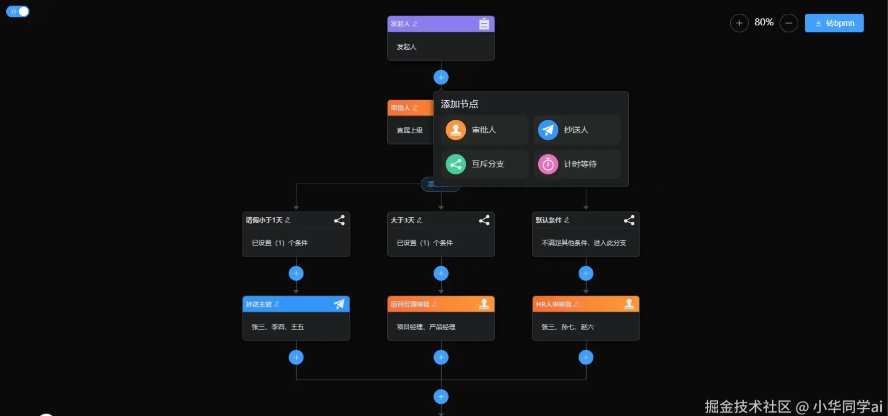
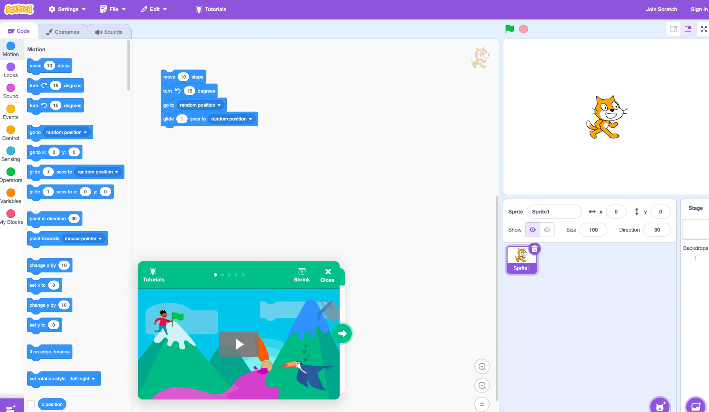
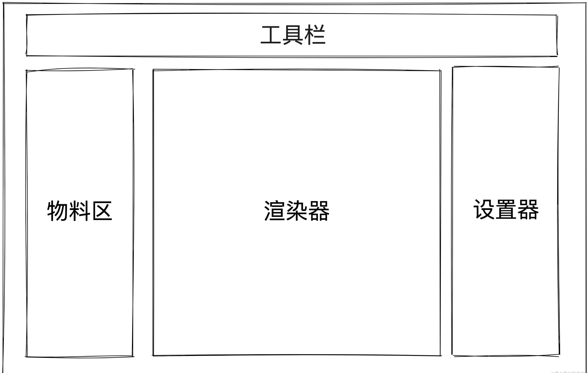
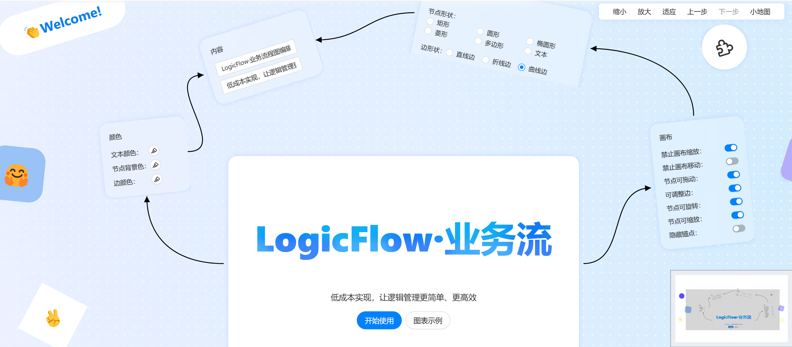
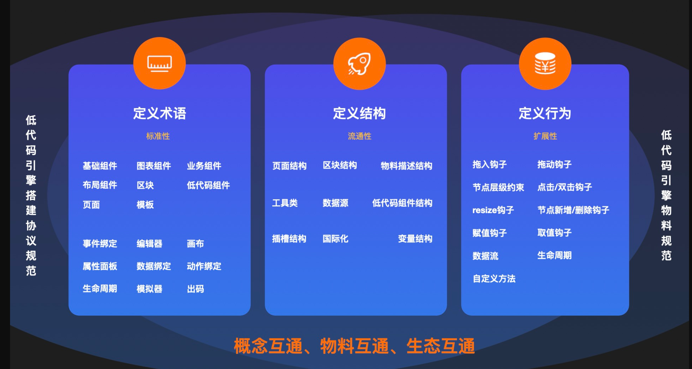
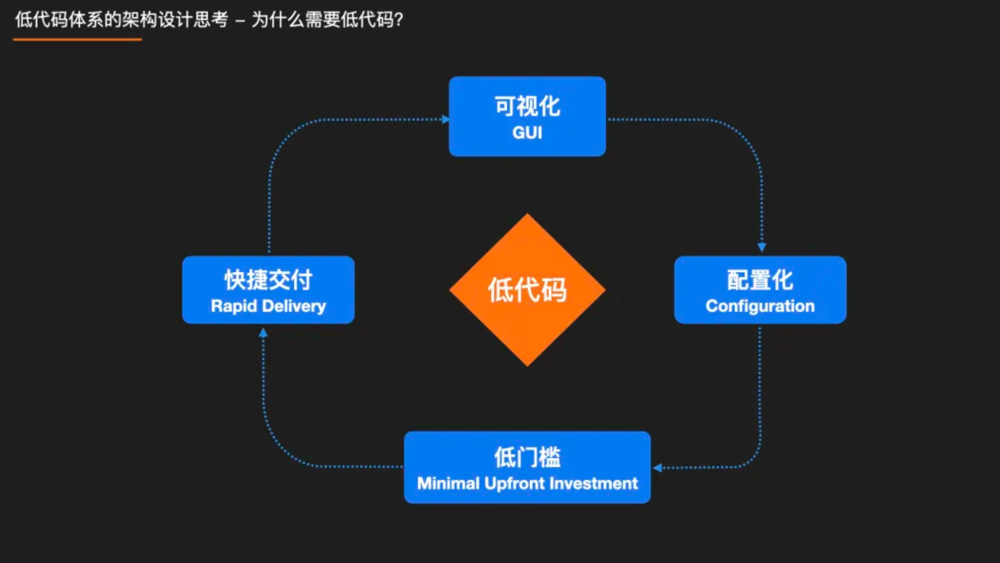
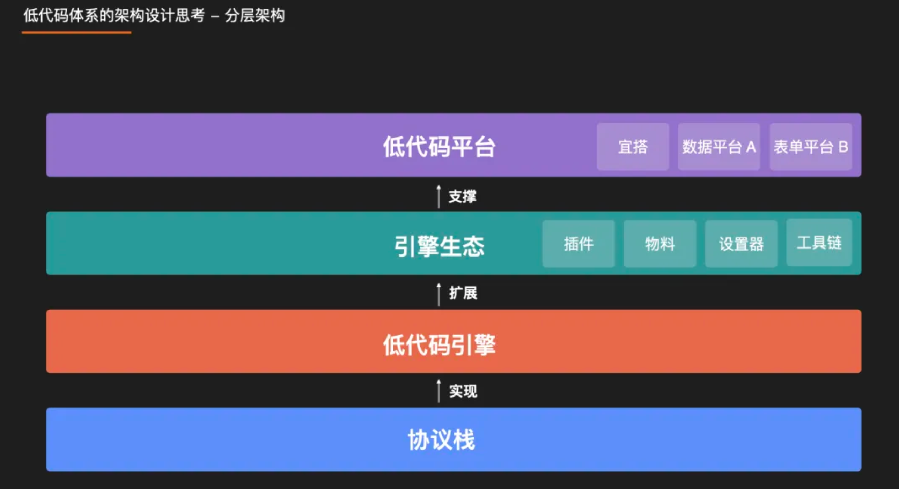
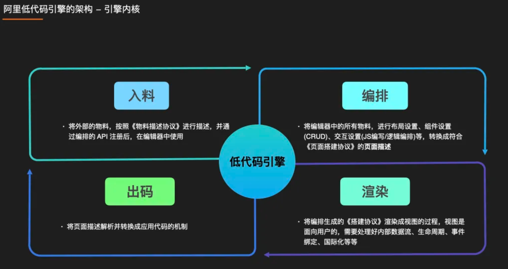

# 关于低代码--我的理解

*我在b站实习的时候，负责的就是低代码平台（参与设计与开发x），所以对低代码还是有点自己的理解，我接触到的无论是b端中台后台还是c端的h5页面海报页面（非客户端页面），几乎都是基于低代码平台实现的。*

>为什么我们需要低代码？--->提高应用软件的开发效率，降低应用软件的开发门槛。--->降本增效

>关于低代码：第一种就是用拖拉拽的方式，来快速搭建某个 页面 / 表单 / 海报 / 游戏等。
>第二种形如在线文档的方式来生成页面。

- 低代码最重要的是方向。
- 低代码的基石是协议。
- 低代码最大的优势是可视和高效。
- 低代码所有的操作都是在操作一个json。

比如：
- 阿里开源的低代码引擎：*拖拽类型*  https://lowcode-engine.cn/index
- tally *文档类型*： https://tally.so/

## 优缺点：
#### 优点：
- 低代码的本质是提效，同时给了自由度。以较少的成本达到想要的结果。
- 优势是可视和快速
- 学习成本低，c端用户/产品运营都可以用
- 能力源自于物料库，物料库里有什么就能组成什么

#### 缺点：
-  上手成本，除了海报大部分情况下还是要摸索很久的。*这个我个人觉得取决于你写的怎么样吧*
- 前端框架日新月异，过一两年来个改革，低码平台就得适配一遍，维护成本相当大；又或者平台自身升级了，你也不知道会对自己的项目产生什么影响，但是不跟着升级后面就没法迭代；并且基本上你用了一个平台的低代码，要想切换到其他平台那就得从 0 到 1
- 不好维护和迭代，换个同类型组件都得考虑一下，如果换个人还得重新理解，还不好调试，不好定位问题，也不好确定本次改动对之前功能的影响
- 不好优化（比如你现在想做性能优化，完全没有头绪🤯）
- 二次开发不可逆，很难做到持续可视化（确实，大部分情况是这样🤷🏻‍♀️）
- 随便举个反例，只要低代码平台没有实现那就是缺点😂
- ...

确实，低代码自身限制还是很多的，随便提个改动，都可能牵一发动全身。不过这里我们并不会去评判低码平台的好坏，而只是单纯的分享一些低代码中的核心思路和整个流程：包括但不限于模块划分、如何解耦和扩展、画布的实现方式等等。

## 低代码适用场景
*交互简单，轻逻辑*
比如 Figma Ps 等作图海报软件内部肯定有低代码逻辑

举例一些我在b站接触到的吧：

#### C端：
- 海报页面
- H5运营活动页（一次性的页面很实用，没有维护烦恼，可以不用担心频繁发版的成本or隐患）
- 用户表单收集页（用户问卷调查）

#### B端
- 各种流程管理平台
- 中后台界面

#### 2D游戏制作
https://docs.cocos.com/creator/3.8/manual/zh/editor/

为什么要简单呢（包括交互和逻辑）？因为一旦复杂就不可视了，本来的拖拽优势也没有了。
通常情况下，低码平台只实现了视图可视化，并没有实现逻辑可视化，逻辑一复杂还是得写代码。根本原因是我们很难将逻辑进行可视化，它不如写代码来的干脆明了。当然目前也有比较适合于逻辑可视化的场景（前提是逻辑比较固定），比如审批流和[Scratch](https://link.juejin.cn?target=https%3A%2F%2Fscratch.mit.edu%2F "https://scratch.mit.edu/")。那如何才能做到简单呢？还是得朝着垂直方向发力😂，也就是会有点定制，要固化一些操作、约束一些行为。目前我还是觉得低代码主要还是给非研发同学用的，所以要足够简单🤔。

*Rush是一个专为B端用户设计的业务流程化平台，旨在提供高效、灵活的业务流程管理解决方案。*
*流程模板图示不太好展示因为是公司内部的，可以参考：lowflow-design：低代码流程设计器，让流程搭建更简单！*

掘金链接：https://juejin.cn/post/7417374536671707151?searchId=202411031339077B43BBB91AC2E7167EDF

## 基本实现

# 协议（规范）
物料协议
平台搭建协议。。。

- 当我们想扩展物料时，需要实现相应的协议
- 当我们把左侧一个物料拖到中间画布区时，需要通过协议来通信和解析
- 当我们选中画布区域的组件时，要想通过右边设置面板进行属性设置时，也需要通过协议来通信和解析
- 当我们准备预览和发布代码时，也需要通过协议来生成代码

>协议是低码平台的基石，它的主要目的就是约束和扩展，约定的好，事半功倍；约定不好，版版重构。约定优于配置说的就是这个道理。如果维护到后期发现协议很难拓展了，那基本只能重来了。协议本质上就是一堆 interface（就是固定格式啦）。

# 如何实现

# 低代码的意义

# 分享一些开源低代码项目供大家学习
- 我的低代码简历编辑器项目 kawa-resume（孵化中）有兴趣可以来写 ：https://github.com/kawa-fe/kawa-resume
- 滴滴的低代码流程图框架 LogicFlow ：https://github.com/didi/LogicFlow

LogicFlow 是一款滴滴客服技术团队开源的流程图编辑框架，它提供了一系列流程图交互、编辑所必需的功能和灵活的节点自定义、插件等拓展机制。自发布以来，LogicFlow 影响力持续增长，现已成为国内头部开源流程图编辑框架，GitHub star 数量已超过 7.4k，npm 下载量累计超过 300k。除了我们内部团队的使用外，还吸引了如美团、京东、华为等企业的技术团队在项目中应用 LogicFlow。

- 阿里低代码引擎：https://github.com/alibaba/lowcode-engine

> 低代码引擎分为 4 大模块，入料、编排、渲染、出码。
> 入料模块就是将外部的物料，比如海量的 npm 组件，按照《物料描述协议》进行描述。注意，这里仅是增加描述，而非重写一套，这样我们能最大程度复用ProCode体系已沉淀的组件。将描述后的数据通过引擎 API 注册后，在编辑器中使用。
> 编排，本质上来讲，就是不断在生成符合《搭建协议》的页面描述，将编辑器中的所有物料，进行布局设置、组件 CRUD 操作、以及 JS/CSS编写/逻辑编排等，最终转换成页面描述，技术细节待会儿我们再展开讲讲。
> 渲染，顾名思义，就是将编排生成的页面描述结构渲染成视图的过程，视图是面向用户的，所以必须处理好内部数据流、生命周期、事件绑定、国际化等。
> 出码，就是将页面描述结构解析和转换成应用代码的机制。对于一些常规场景，直接由渲染模块渲染即可。但是考虑到一些特殊情况，比如一些不支持动态化的场景，小程序，或者为了更好的性能，转码成 ProCode 打包部署，或者需要二次开发，因此，我们设计了出码框架。出码框架提供一套流水线式的处理流程，类似 babel 的机制，通过一个个的出码插件 / preset 来定制你的出码产物，市面上的 react 框架、vue 框架、小程序框架都可以支持。

# 低代码优秀文章推荐

- [阿里低代码引擎和生态建设实战及思考](https://mp.weixin.qq.com/s/MI6MrUKKydtnSdO4xq6jwA)
- [低代码引擎的架构设计与实现](https://mp.weixin.qq.com/s/DDt4LQLFUBQ2-F5ehZGBKg)
- [基于 LowCodeEngine 的低代码组件体系的建设和实践](https://mp.weixin.qq.com/s?__biz=Mzg4MjE5OTI4Mw==&mid=2247499841&idx=1&sn=139cb04400fd8125093dde3371e8a19f&scene=21#wechat_redirect)
- [什么是比较好的低代码产品](https://mp.weixin.qq.com/s/DDt4LQLFUBQ2-F5ehZGBKg)
- [低代码多分支协同开发的建设与实践](https://mp.weixin.qq.com/s/DmwxL67htHfTUP1U966N-Q)
- [低代码技术在研发团队的应用模式探讨](https://mp.weixin.qq.com/s/Ynk_wjJbmNw7fEG6UtGZbQ)
- [低代码渲染那些事](https://mp.weixin.qq.com/s/yqYey76qLGYPfDtpGkVFfA)
- [关于 LowCode&ProCode 混合研发的思考](https://mp.weixin.qq.com/s/TY3VXjkSmsQoT47xma3wig)
- [流程图框架 LogicFlow 2.0 终于来啦](https://juejin.cn/post/7402987272504623156)   
