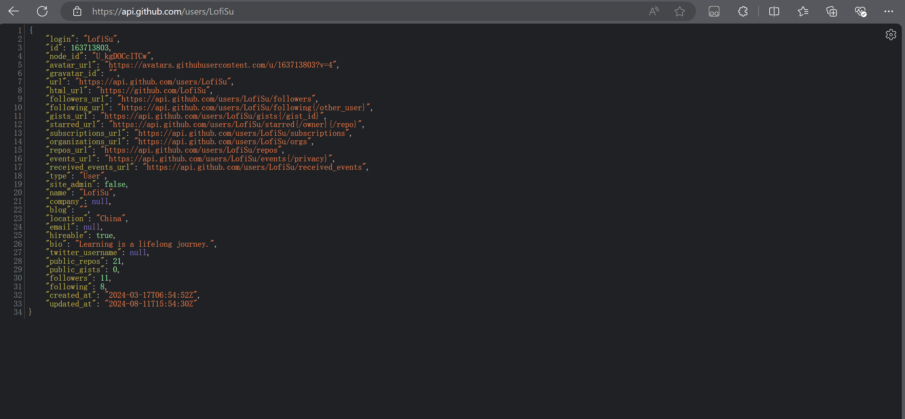

GitHub 数字 ID 是每个 GitHub 用户或组织的唯一标识符。它可以通过访问 GitHub API 或者查看用户资料页面的 HTML 源代码来找到。

### 1. 通过 GitHub API 获取数字 ID
你可以通过 GitHub API 直接获取用户或组织的数字 ID。

- 用户的 API URL 通常为：
  ```
  https://api.github.com/users/{username}
  ```
- 组织的 API URL 通常为：
  ```
  https://api.github.com/orgs/{orgname}
  ```

用你要查询的用户名替换 `{username}`，然后访问该 URL。

**例子**：对于 GitHub 用户 `octocat`，API URL 是：
```
https://api.github.com/users/octocat
```

访问这个 URL 后，你会看到一个 JSON 响应，其中包含 `id` 字段，就是数字 ID。

### 2. 在用户或组织页面的 HTML 源代码中查找
你还可以通过查看 GitHub 用户或组织页面的 HTML 源代码来找到数字 ID。

1. 打开 GitHub 用户或组织的页面。
2. 右键点击页面并选择“查看页面源代码”或按 `Ctrl+U` (Windows/Linux) 或 `Cmd+Option+U` (Mac)。
3. 在源代码中搜索 `"user-id"` 或 `"data-user-id"`。
4. 紧跟在其后的数字即为该用户的数字 ID。

### 3. 通过浏览器插件或开发者工具
有些浏览器插件或开发者工具扩展可以帮助你快速找到 GitHub 用户的数字 ID。

### 例子
对于 GitHub 用户 `octocat` 的页面，打开源代码后，搜索 `user-id` 或 `data-user-id` 可能会看到如下内容：
```html
<div class="user-profile-nav" data-user-id="583231">
```
其中 `583231` 就是该用户的数字 ID。


